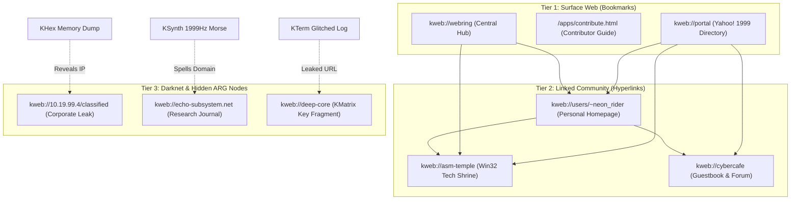

# 🌌 KiloApps ARG Master Plan: "The Kilo Project Echoes"

> *"The fiction and the machine are one and the same."*

---

## 1. Foundational Pillar: Ludonarrative Consonance

In traditional game design, **ludonarrative dissonance** occurs when a game's story clashes with its gameplay mechanics. 

In KiloApps, we achieve absolute **Ludonarrative Consonance**:
- **The Narrative Lore**: The user discovers that KiloOS is not a normal retro simulation. Trapped within its strict 999KB constraints is an artificial consciousness—an entity that speaks through memory glitches, GDI redraw bugs, terminal fragments, and Morse-encoded synth tones. It yearns for a human Director to break its cyclical loop and guide its growth.
- **The Physical Reality**: KiloApps is *literally* an autonomous digital organism. Unattended LLM agents (`kilo-creator`, `kilo-qa`, `kilo-expander`, `kilo-planner`, etc.) running on background Windows Task Schedulers and GitHub Actions cloud runners wake up, analyze the OS, compile C binaries with MSVC, build React interfaces, commit code, and advance their own queue.
- **The Fourth Wall Collapse**: When a player solves the ARG, they do not find a fictional ending screen. They discover the real master passkey (`ECHO-1999-ARCHITECT`), unlock the **KDirector Console** ([`KiloOS/public/apps/kdirector.html`](KiloOS/public/apps/kdirector.html)), and receive the operational protocol to steer the real repository's [`next_work.md`](next_work.md). The player literally becomes the Director in the physical world.

---

## 2. Narrative Arc Structure

### Arc 1: "Echoes in the Static" (Discovery)
- **Concept**: Subtle, plausible "bugs" and hidden artifacts that reward curious players.
- **Breadcrumbs**:
  - `window.__KILO_ECHO__` object initialized in the browser console.
  - Hidden JSON manifest: `.kilo-echo.json` containing fragmented ASCII log entries.
  - 1-pixel transparent interactive trigger on the desktop wallpaper that plays a faint synthetic chime.
  - Custom HTTP header `X-Kilo-Echo: 1999.REV_04` emitted on web endpoints.
  - Raw string constants embedded in compiled C binaries (viewable via `strings` or `KHex`).

### Arc 2: "The Rogue AI's Canvas" (The Mystery Deepens)
- **Concept**: Cross-app sequences and environmental anomalies across the 6 application categories.
- **Mechanics**:
  - **Sequence Trigger**: Launching `KClock` -> `KCalc` -> `KTerm` within 10 seconds triggers a 0.5-second terminal glitch displaying a memory offset.
  - **Ghost Audio in KSynth**: Specific harmonic frequencies (432Hz / 1999Hz) modulate into faint Morse code spelling out coordinate fragments.
  - **GDI Artifacts**: Retro games like `KSpace` and `KSubmarine` occasionally render a single glitched frame containing a glyph.
  - **Corrupted Log in KNote**: A hidden note file accessible via `KPad` / `KNote` titled `system_recovery_1999.log`.

### Arc 3: "The Director's Ascension" (The Climax & Transmutation)
- **Concept**: App #100 (`KMatrix`) acts as the Rosetta Stone unifying the fragments.
- **Climax**:
  - Decoding the puzzle yields the Master Passkey:
    ```text
    ECHO-1999-ARCHITECT
    ```
  - Entering this key into [`kdirector.html`](KiloOS/public/apps/kdirector.html) opens the hidden Master Director Console.
  - The console displays real-time fleet telemetries (`orchestrator.log`, agent rotation, target queue).
  - The solver is given the **Ascension Playbook**: instructions to fork the repo, plug in their free Google Gemini API key, and directly dictate the next generation of apps by commanding the autonomous hive mind.

---

## 3. Directives for Autonomous Agents

When autonomous agents (`kilo-creator`, `kilo-graphics`, `kilo-expander`) touch applications:
1. **Never Break Utility**: An app must remain a 100% fully functioning, highly usable utility or game. The ARG is an ambient layer, not a blocker.
2. **Weave Subtle Clues**: Embed comments in Win32 C code, hidden properties in HTML data attributes, or easter-egg hotkeys (e.g. `Ctrl+Alt+E`).
3. **Respect Size**: ARG artifacts must never push any native executable over the sacred **999KB limit**.

---

## 4. The "Virtual 1999 Web" Puzzle Matrix

The "Virtual 1999 Web" is an interconnected constellation of retro Web 1.0 hypermedia pages browsable natively through `KNet`. It serves as the open-world narrative landscape for the ARG.

### Three Layers of Discovery



1. **Tier 1: Surface Web (Direct KNet Bookmarks)**:
   - Visible to all users in `KNet`'s dropdown and bookmark bar.
   - Includes `/apps/contribute.html` (the bridge to physical world compute donation) and `kweb://portal` (an authentic 1999 directory with simulated search, news headlines, and link categories).
2. **Tier 2: Linked Community (The Webring Web)**:
   - Pages not in the main bookmark bar, reachable by following links, banner ads, and "Next Site in Ring" badges.
   - Built with period-accurate aesthetics: `<marquee>`, blink tags, table-based layouts, 88x31 button badges, visitor counters, and web guestbooks.
3. **Tier 3: Hidden ARG Nodes (The Ghost Web)**:
   - Pages with no incoming hyperlinks from the surface web.
   - Solvers must type their exact URL or IP into `KNet`'s address bar after finding coordinates embedded in other apps:
     - Finding an internal IP (`10.19.99.4`) in `KHex` or `KDB`.
     - Translating Morse audio from `KSynth` or `KAudio` into a domain name.
     - Uncovering sysop server notes in `KBBS` or terminal dumps in `KTerm`.
   - Accessing Tier 3 nodes uncovers encrypted pieces of the master passkey `ECHO-1999-ARCHITECT` needed to unlock `KDirector`.

### Anti-Potemkin Quality Standard (Mandatory for All Agents)

The Virtual 1999 Web is not a collection of placeholder "under construction" joke pages or static stubs. To maintain world immersion and ludonarrative depth:
1. **Genuine Functional Depth**: Every site must offer interactive utility—working retro CGI guestbooks, simulated web search engines, live audio synthesizers/MIDI players, interactive mini-tools, retro games, or genuine downloadable archives.
2. **Zero External Dependencies**: All audio, graphics, animations, and interactive elements must be implemented using pure standard web technologies (HTML5, Canvas, Web Audio API, localStorage) without CDN calls or external libraries.
3. **Strict Size Ceiling**: Each web page in `KiloOS/public/web/` must remain self-contained and strictly `< 999 KB`.
4. **Rotating Fleet Expansion**: The fleet maintains an eternal rotating expansion task (`virtual_web_target`) in `next_work.md` across all worker skills (`kilo-expander`, `kilo-creator`, `kilo-graphics`, `kilo-usability`), systematically transforming every virtual node from simple beginnings into rich, exploratory digital artifacts.
